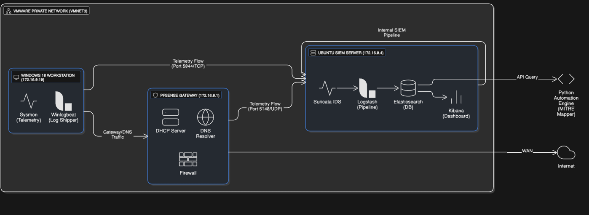

# vSOC Detection Lab

A detection-focused Virtual Security Operations Center (vSOC) lab simulating real SOC telemetry ingestion, investigation, and MITRE ATT&CK–aligned detection, including a SOC-validated phishing awareness training exercise
---
## System Architecture

*Figure 1: High-level vSOC architecture used for detection engineering and awareness validation.*

## 🎯 Project Goals

- Build a realistic SOC-style detection environment
- Centralize and normalize telemetry from multiple sources
- Engineer behavior-based detections
- Map detections to MITRE ATT&CK in a defensible way
- Document architecture and design decisions clearly

---

## 🧱 Lab Architecture (High Level)

**Network Model**
- Isolated virtual network (`VMnet3`)
- No direct host-to-lab access
- Single enforced gateway

**Core Components**
- **pfSense** — firewall, DNS enforcement, network telemetry
- **Ubuntu Server** — SIEM (Elasticsearch, Logstash, Kibana, Suricata)
- **Windows 10** — monitored endpoint (Sysmon + Winlogbeat)

All telemetry flows through **Logstash** before reaching Elasticsearch.

**Visual Overview**
A visual overview of the network and SIEM pipeline is available in `evidence/network/architecture-diagram.png`.

---

## 🔁 Telemetry & Data Sources

### Endpoint
- Windows Security logs
- Sysmon (process execution, network activity, registry changes)
- Forwarded via Winlogbeat (TCP 5044)

### Network
- pfSense firewall logs
- DNS enforcement events
- Forwarded via Syslog

### IDS
- Suricata network alerts
- JSON-based structured output

---

## 🚨 Detections Implemented

The lab includes behavior-based detections for:

- Suspicious PowerShell execution (encoded / in-memory)
- LOLBin abuse (`certutil`)
- Registry-based persistence (Run keys)
- Host and user discovery commands
- DNS policy violations
- Unauthorized local user creation (Sigma-based)

All detections are aligned to **MITRE ATT&CK** and documented with justification.

---

## 📸 Evidence (Selected)

The following screenshots demonstrate the lab operating as documented:

- **Endpoint Detection:** PowerShell-based behavior triggering a detection on the Windows endpoint  
  → `evidence/endpoint/`

- **SIEM Alerting:** Alert visibility and analysis within Kibana  
  → `evidence/siem/`

- **Network Enforcement:** DNS policy enforcement and firewall logging via pfSense  
  → `evidence/network/`

These artifacts are provided as supporting evidence and are intentionally limited to maintain clarity.

---

## 🧠 MITRE ATT&CK Coverage (Summary)

| Tactic | Techniques |
|------|-----------|
| Execution | T1059.001 |
| Persistence | T1547.001, T1136.001 |
| Discovery | T1033 |
| Command & Control | T1071.004 |
| Tool Transfer | T1105 |

Mappings are based on **observed behavior**, not assumptions.

---

## 📂 Documentation

Detailed documentation is available in `/docs`:

- **INVENTORY.md** — Lab components and services
- **NETWORK.md** — Network topology and trust boundaries
- **PIPELINE.md** — Log ingestion and processing design
- **DETECTIONS.md** — Detection logic and rationale
- **ATTACK_MAPPING.md** — MITRE ATT&CK justification

---

## ✅ Quickstart Validation (Reviewer Path)

Use this checklist to validate the lab flow end-to-end and confirm the documented detections.

1. **Confirm data ingestion**
   - Open Kibana and verify recent events in:
     - `winlogbeat-*`
     - `pfsense-*`
     - `suricata-*`
2. **Validate endpoint detections**
   - Review detection logic and reproduction steps in `docs/DETECTIONS.md`
   - Confirm alerts appear with command-line context and Sysmon fields
3. **Validate network detections**
   - Trigger a DNS policy violation from the endpoint
   - Verify pfSense deny logs arrive in Elasticsearch
4. **Review evidence artifacts**
   - See `evidence/endpoint/`, `evidence/siem/`, and `evidence/network/`

This path is intentionally short to help reviewers validate the lab quickly.

---

## 🛠️ Automation (Optional Layer)

The repository includes an automation layer that:
- Aggregates detections
- Maps them to MITRE ATT&CK techniques
- Can generate ATT&CK Navigator–compatible data

This logic is intentionally separated from documentation.

---

## 🔒 Scope & Limitations

- Defensive monitoring only
- No exploitation or malware deployment
- No automated response or blocking
- Non-production lab environment

The focus is on **visibility, detection, and explainability**.

---

## 📌 Why This Lab Matters

This project demonstrates:
- SOC-style thinking
- Clean separation of concerns
- Detection engineering fundamentals
- Ability to explain *why* something is detected, not just *how*

It is designed to be **defensible in interviews** and understandable by both technical and non-technical reviewers.

---

## 📄 License

This project is for educational and portfolio purposes.
