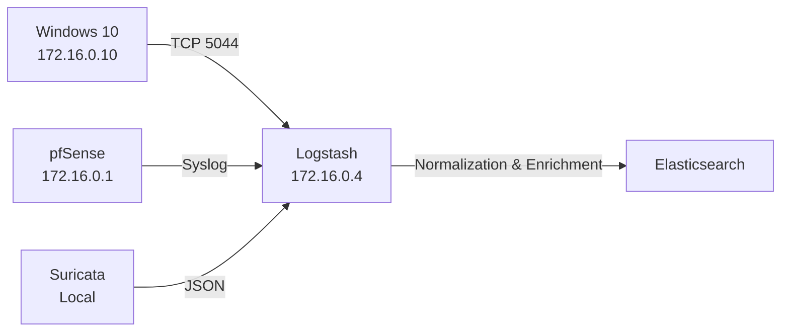

# Network Architecture

This document describes the network layout, trust boundaries, and traffic flow of the vSOC lab environment.  
All details reflect the **actual deployed topology**, not a theoretical design.

---

## 1. Network Overview

- **Network Type:** Isolated virtual network  
- **Virtual Switch:** VMnet3  
- **Address Space:** 172.16.0.0/24  
- **Internet Access:** Controlled via gateway (pfSense)  
- **Host Access:** No direct host-to-lab connectivity  

> **Note:** The lab is intentionally **air-gapped from the host system** to safely simulate attacker behavior and enforce SOC-style containment.

## 1.2 Architecture Diagram

A high-level diagram of the deployed vSOC network and telemetry flow is provided below.

See: `evidence/network/architecture-diagram.png`

---

## 2. Network Topology

### 2.1 Virtual Machines and IP Roles

| Component | Role | IP Address | Network |
|---------|-----|-----------|---------|
| pfSense | Gateway / Firewall | 172.16.0.1 | VMnet3 |
| Ubuntu Server | SIEM / ELK Stack | 172.16.0.4 | VMnet3 |
| Windows 10 | Endpoint | 172.16.0.10 | VMnet3 |

All systems reside on the same **private subnet** and communicate only through defined paths.

---

## 3. Trust Boundaries

### 3.1 Gateway Boundary (pfSense)

pfSense acts as the **single trust boundary** between:
- Internal lab systems
- External networks

All inbound and outbound traffic is subject to:
- Firewall rules
- DNS enforcement policies
- Logging and inspection

There is **no direct routing** between lab systems and the host.

### 3.2 Internal Trust Model

Inside the lab:
- **Endpoints** are treated as **untrusted**
- **The SIEM** is treated as a **protected monitoring asset**
- **The Gateway** is treated as **security enforcement infrastructure**

This mirrors real SOC environments where detection systems are hardened and endpoints are potential compromise points.

---

## 4. Traffic Flow (Confirmed)

### 4.1 Architecture Diagram

### 4.2 Endpoint Telemetry

Windows 10 (172.16.0.10)
→ Winlogbeat (TCP 5044)
→ Logstash (172.16.0.4)
→ Elasticsearch

Traffic is unidirectional

No direct endpoint-to-Elasticsearch access

All data passes through Logstash for normalization

### 4.3 Network Telemetry

pfSense (172.16.0.1)
→ Syslog
→ Logstash (172.16.0.4)
→ Elasticsearch

Firewall and DNS activity is forwarded for correlation with endpoint telemetry.

### 4.4 IDS Telemetry

Suricata (running on the SIEM host)
→ JSON alert output
→ Logstash
→ Elasticsearch

Network-based detections complement endpoint visibility.

## 5. DNS Enforcement Model

pfSense acts as the authoritative DNS path for the lab.

Direct external DNS access from endpoints is blocked

All DNS queries are observable and logged

Design benefits:

Prevents DNS-based command-and-control bypass

Forces visibility into name resolution behavior

Enables policy-based detection of violations

## 6. Isolation Rationale

The use of VMnet3 provides:

Safe attack and malware simulation

No risk to the host system

Controlled egress points

Predictable traffic paths for detection engineering

This isolation is intentional and central to the lab’s realism.

## 7. Security Posture Summary

Gateway: Single enforced point of entry and exit

Host: No lateral access permitted

Telemetry: Centrally collected

Defense-in-depth layers:

Endpoint

Network

Gateway