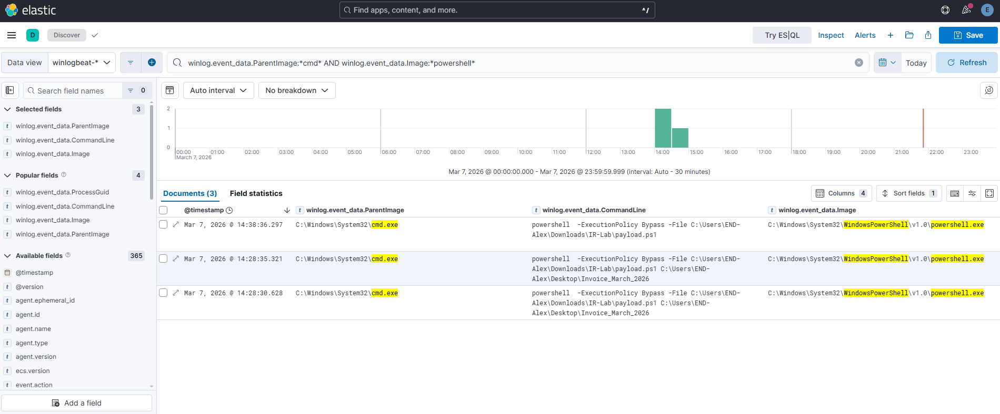
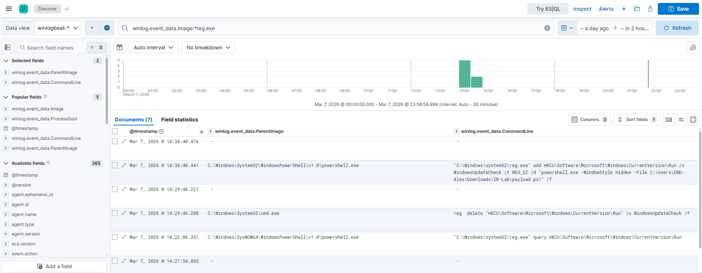

---

# vSOC Lab – PowerShell Execution & Persistence Incident Investigation

## Overview

This project documents a simulated security incident investigation performed in a virtual SOC lab environment. The scenario involves suspicious PowerShell execution triggered through a command interpreter and the creation of a persistence mechanism via the Windows Run registry key.

The investigation demonstrates how endpoint telemetry can be analyzed using a SIEM platform to reconstruct attack activity, identify persistence techniques, and develop detection rules.

---

## Lab Environment

* **Endpoint:** Windows 10 Virtual Machine
* **Logging:** Sysmon
* **Log Forwarding:** Winlogbeat
* **SIEM Platform:** Elastic Stack (ELK)
* **Network:** Isolated lab network (VMnet)

---

## Attack Scenario

A user executed a disguised file which launched the Windows command interpreter. The command interpreter then executed a PowerShell script with `ExecutionPolicy Bypass`, allowing the script to run without local policy restrictions.

The script performed the following actions:

1. Executed a PowerShell payload
2. Created an artifact file on the system
3. Established persistence using a Windows Run registry key

---

## Execution Chain

```
explorer.exe
    ↓
cmd.exe
    ↓
powershell.exe -ExecutionPolicy Bypass
    ↓
payload.ps1
    ↓
Registry Run Key Persistence
```

---

## Evidence

### Suspicious PowerShell Execution

PowerShell was executed from `cmd.exe` using the `ExecutionPolicy Bypass` argument.



MITRE ATT&CK

* T1059.001 – PowerShell
* T1059.003 – Command Shell

---

### Registry Persistence

The payload created persistence through a Run registry key.



Registry path:

```
HKCU\Software\Microsoft\Windows\CurrentVersion\Run
```

MITRE ATT&CK

* T1547.001 – Registry Run Keys / Startup Folder

---

## Detection Engineering

Following the investigation, detection logic was developed to identify similar behavior.

Example detection query:

```
winlog.event_data.ParentImage:*cmd* AND
winlog.event_data.Image:*powershell* AND
winlog.event_data.CommandLine:*ExecutionPolicy*
```

Additionally, a Sigma rule was created to provide portable detection logic.

Location:

```
detection/endpoint/execution/
```

---

## Investigation Artifacts

The investigation includes the following documentation:

```
incident-response
│
├── incident-report.md
└── investigation
    ├── timeline.md
    ├── evidence.md
    ├── queries.md
    ├── gap-analysis.md
    └── improvements.md
```

---

## Skills Demonstrated

* Security event investigation
* Endpoint telemetry analysis (Sysmon)
* SIEM analysis using Elastic
* MITRE ATT&CK mapping
* Detection engineering (Sigma + SIEM rules)
* Incident documentation and reporting

---

## Conclusion

This investigation demonstrates how suspicious script execution and persistence mechanisms can be identified through endpoint telemetry analysis. By developing detection rules based on observed attack behavior, the lab environment improves its ability to detect similar threats in the future.

---

If you want later, we can also improve the README to make it **look more like a professional SOC portfolio project** (things like architecture diagrams, badges, and attack timeline visualization).
