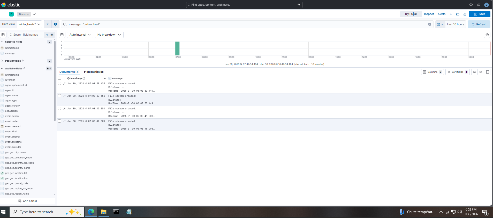

# SOC Evidence — Phishing Awareness Exercise

## 1. Evidence Handling Principles

All evidence collected during this exercise follows standard SOC principles:

* Evidence is observational, not inferred
* Conclusions are drawn only from verified telemetry
* No assumptions about attacker success are made
* Absence of evidence is explicitly stated where applicable

---

## 2. Evidence Sources

### 2.1 Endpoint Telemetry

* Source: Windows endpoint
* Collection: Sysmon via Winlogbeat
* Visibility: Elastic Stack (Discover)

### 2.2 Security Controls

* Microsoft Defender (endpoint protection)
* Browser security mechanisms

### 2.3 SIEM

* Elastic Stack (ELK)
* Centralized event correlation and timeline analysis

---

## 3. Primary Evidence Items

### 3.1 User Interaction Evidence

**Figure 1: Browser-Initiated Download Attempt**

*Elastic SIEM evidence showing browser-initiated `.crdownload` file creation following phishing link interaction.*

**Evidence Type:** File creation event
**Process:** `msedge.exe`
**Artifact:** `.crdownload` file
**Location:** User Downloads directory
**Zone Identifier:** Internet

**Interpretation:**
This confirms the user clicked the phishing link and the browser initiated a download attempt from an external source.

---

### 3.2 Endpoint Protection Evidence

**Evidence Type:** Absence of execution events
**Observation:**

* No process execution of downloaded content
* No child processes spawned from the browser
* No persistence-related activity

**Interpretation:**
Microsoft Defender real-time protection was enabled on the endpoint during the exercise. No malware execution, remediation, or quarantine events were observed, indicating that the phishing attempt did not progress beyond the pre-execution stage.
---

### 3.3 Network Evidence

**Evidence Type:** Network activity review
**Observation:**

* No confirmed evidence of successful outbound data exchange
* No evidence of command-and-control communication

**Interpretation:**
There is no indication of post-click network impact.

---

### 3.4 SIEM Pipeline Validation

**Evidence Type:** Log ingestion verification
**Observation:**

* Relevant Sysmon events present in SIEM
* Correct timestamps and provider fields
* End-to-end visibility confirmed

**Interpretation:**
SOC monitoring and ingestion pipelines functioned as intended.

---

## 4. Timeline Reconstruction

Based on correlated evidence:

1. Phishing email delivered
2. User opened email
3. User clicked embedded link
4. Browser initiated download
5. Endpoint protections prevented completion
6. No execution or persistence observed

This timeline is fully supported by telemetry.

---

## 5. Evidence Gaps & Limitations

* No email gateway logs (lab scope)
* Single endpoint visibility
* Single scenario execution

These gaps are documented and understood.

---

## 6. Evidence Conclusion

The collected evidence confirms:

* User interaction occurred
* Endpoint protections prevented harm
* No compromise took place
* SOC visibility was sufficient to support confident classification

All conclusions are evidence-backed.

---

